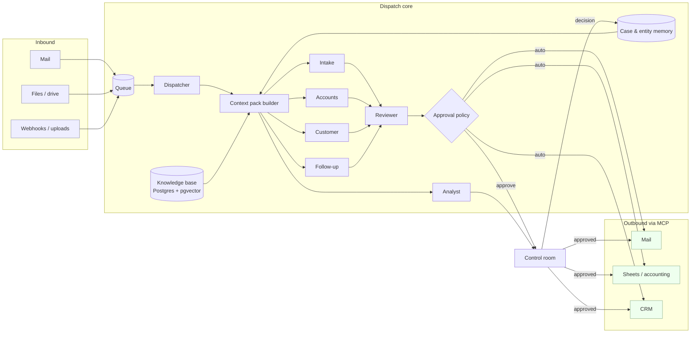

# Dispatch

**An AI operations team for businesses that run on email, PDFs and spreadsheets.**

Forward Dispatch your inbox, your documents and a connection to the tools you already use. A team of specialist AI agents triages what comes in, extracts what matters, reconciles it against your records, drafts what needs a reply, chases what is overdue and reports what changed. It asks a human only when your policy says it must, shows every step it took, and proves every number back to the source document.

> **Status: v0 runs.** The Northwind morning runs end to end on your machine: eight items, all seven agents, the Reviewer, the approval matrix, the control room with live transcript, approvals, ledger and memory. Bring your own key (Anthropic, or any OpenAI-compatible endpoint such as vLLM) from the settings panel, or run the keyless mock to see the mechanics. See [Running it](#running-it). What is still a plan is in [`docs/PLAN.md`](docs/PLAN.md) and the [issues](../../issues).

Built by [Shreyas Pachpute](https://shreyaspachpute.in), one person, end to end. MIT licensed.

---

## Why this exists

Most businesses do not have a data problem. They have a *paperwork* problem. Invoices arrive as PDFs, purchase orders live in a spreadsheet, customers ask questions by email, contracts sit in a shared drive, and a handful of people spend their week moving facts from one of those places to another. Every one of those steps is slow, error-prone and interrupts the people who should be doing something else.

I have spent the last two years building AI into products that do exactly this kind of work: agents inside an ERP-to-CRM integration platform, and the AI backend of a tax-prep platform that turns a shoebox of client documents into a first-reviewed return. Dispatch is what I would build for a business from scratch, with everything I learned, in the open:

- **Grounded, or it does not say it.** Every extracted number, every claim in a drafted reply, links back to the source document or record. If the evidence is not there, the agent says so and escalates.
- **Context engineering, not prompt stuffing.** Each agent gets a purpose-built *context pack* under a token budget: the task, the policies that apply, the evidence that matters, what the business decided in similar cases before, and only the tools it needs. See [`docs/CONTEXT_ENGINEERING.md`](docs/CONTEXT_ENGINEERING.md).
- **Human in the loop by policy, not by vibes.** An approval matrix decides what runs automatically, what only notifies, and what waits for a person. Every outbound action passes an independent Reviewer agent before it reaches the queue.
- **Evaluated in CI.** Golden cases for extraction, routing, policy compliance and reply quality. A change that lowers the score does not merge. See [`docs/EVALS.md`](docs/EVALS.md).
- **Observable.** A control room shows what the team is doing, what is waiting on you, what each decision cost, and the ledger of work it did for you.
- **Your models, your data.** Claude by default. Any OpenAI-compatible endpoint, including self-hosted open-weight models on vLLM, when cost, privacy or control matter more.
- **Integrations via MCP.** Mail, files, sheets, CRM and accounting are Model Context Protocol servers. Add your own system by writing one.

## A day with Dispatch

The demo company is *Northwind Supplies*, a fictional 40-person distributor. The dataset is synthetic and ships with the repo. See [`docs/DEMO.md`](docs/DEMO.md).

| Time  | What happened                                                                                                  | Who handled it                                   |
| ----- | -------------------------------------------------------------------------------------------------------------- | ------------------------------------------------ |
| 07:00 | 38 emails and 12 attachments arrived overnight                                                                 | **Dispatcher** routes each one with a context pack |
| 07:02 | 9 supplier invoices extracted into structured fields, each value traced to a page and box on the PDF            | **Intake**                                       |
| 07:04 | 7 invoices match their purchase orders and are queued for payment; 2 do not, and a query to the supplier is drafted | **Accounts**, then **Reviewer**                  |
| 07:05 | A customer asks where order #4821 is; the reply cites the shipment record and the carrier's tracking page        | **Customer**                                     |
| 07:06 | 3 invoices are 30+ days overdue; reminders are scheduled, the one above $2,000 is held for approval              | **Follow-up**                                    |
| 07:10 | "How did we do last week?" is answered with a table and a chart, from SQL the agent wrote and showed              | **Analyst**                                      |
| 09:00 | The owner opens the control room: 31 items handled, 4 waiting for approval, 2 escalated with a reason           | **Control room**                                 |

Every row above is a planned behaviour with an evaluation case behind it, not a marketing claim. When the phase that delivers it ships, the row links to the recorded run.

## The team

| Agent          | Job                                                                                                                   | Asks a human when                                              |
| -------------- | --------------------------------------------------------------------------------------------------------------------- | -------------------------------------------------------------- |
| **Dispatcher** | Reads every incoming item, decides which specialist owns it, assembles that specialist's context pack                  | Nothing fits, or confidence is low                             |
| **Intake**     | Classifies documents and extracts structured fields against schemas (invoice, PO, contract, form), with source tracing | A required field cannot be found in the document               |
| **Accounts**   | Matches invoices to POs and receipts, flags discrepancies, prepares payment runs, drafts supplier queries               | Amount over the policy limit, or a mismatch it cannot explain  |
| **Customer**   | Drafts replies grounded in order history, policies and the knowledge base                                              | The answer is not in the evidence, or the customer is unhappy |
| **Follow-up**  | Chases overdue invoices, unanswered quotes and expiring contracts on a schedule, never twice for the same thing         | Policy says the recipient or amount needs sign-off             |
| **Analyst**    | Answers business questions with SQL over the operational store, shows the query and a chart                            | Never sends anything; read-only                                |
| **Reviewer**   | Independently checks every outbound action against policy and evidence before it enters the approval queue            | Always: it is the last gate before a person                    |

Full specifications, tools and evaluation cases per agent: [`docs/AGENTS.md`](docs/AGENTS.md).

## How it works



The full component and data-flow description, schemas and deployment layout: [`docs/ARCHITECTURE.md`](docs/ARCHITECTURE.md).

## Stack

| Layer          | Choice                                                            | Why                                                                                       |
| -------------- | ----------------------------------------------------------------- | ----------------------------------------------------------------------------------------- |
| Agents         | Python, [LangGraph](https://github.com/langchain-ai/langgraph)    | Explicit, inspectable state machines; a debuggable agent is a shippable agent             |
| Models         | Claude (Opus 5 for judgment, Sonnet 5 for volume) via the Anthropic SDK; vLLM for self-hosted open-weight models | Best reasoning by default, a private path when the business needs one |
| Retrieval      | Postgres + pgvector, hybrid BM25 + vector, reranked, cited        | One database for everything; citations are a first-class column, not an afterthought     |
| Integrations   | MCP servers (mail, files, sheets, CRM, accounting)                | Standard interface; swap a CSV-backed server for a real system without touching agents    |
| API and queue  | FastAPI, Postgres-backed job queue                                | Boring, observable, no extra infrastructure to run                                        |
| Control room   | Next.js, TypeScript                                               | Live queue, approvals, traces, ledger                                                     |
| Observability  | OpenTelemetry traces to Langfuse                                  | Every decision has a trace, a cost and a duration                                         |
| Evals          | pytest suites, deterministic checks plus LLM-as-judge, in CI      | Quality is a number that must not go down                                                 |

Decisions and the alternatives considered: [`docs/DECISIONS.md`](docs/DECISIONS.md).

## Roadmap

Detailed plan with definition-of-done per phase: [`docs/PLAN.md`](docs/PLAN.md).

- [x] **v0 · vertical slice** — every agent, the Reviewer, the policy matrix, the control room, bring-your-own-key; SQLite, lexical retrieval, recorded tool writes
- [ ] **Phase 0 · Foundations** — compose stack, Postgres queue, tracing to Langfuse, CI
- [ ] **Phase 1 · Knowledge** — ingestion, chunking, hybrid retrieval with pgvector, retrieval evals
- [ ] **Phase 2 · Intake** — OCR, more document types, extraction evals
- [ ] **Phase 3 · Dispatcher, context packs, memory, Reviewer, approval policy** — hardening and evals
- [ ] **Phase 4 · Real MCP servers** for mail, files, sheets, CRM, accounting
- [ ] **Phase 5 · Analyst charts, digests, the work ledger over time**
- [ ] **Phase 6 · Hardening** — evals as CI gate, cost controls, PII redaction, vLLM path, demo recording

## Running it

Python 3.11+ and Node 20+. No database server; v0 uses SQLite in `data/runtime/`.

```bash
git clone https://github.com/shreyas-pachpute/dispatch && cd dispatch
make install            # pip install -e apps/api · npm install in apps/control-room

# terminal 1
make api                # http://127.0.0.1:8787
# terminal 2
make ui                 # http://localhost:3100
```

Open the control room, press **Run the overnight inbox**, and watch the team work through the eight Northwind items. Approve or reject what waits for you; ask the Analyst a question; open any item to see the context pack, the extraction with every quote highlighted on the document, the three-way match, the Reviewer's verdict and the policy decision.

**Hosting it.** The UI is a static Next.js app and runs anywhere (Vercel works). The API needs an always-on server because it keeps a live queue and event stream; `render.yaml` deploys both API and UI on Render's free tier in one click: [Deploy to Render](https://render.com/deploy?repo=https://github.com/shreyas-pachpute/dispatch). A hosted UI can point at any API with `?api=https://your-api-host` in the address bar (remembered in the browser).

**Bring your own model.** Click the model button in the header: choose Anthropic (Opus 5 for judgment, Sonnet 5 for volume, or one model for everything), or any OpenAI-compatible endpoint (OpenAI, a local vLLM, Ollama) with its base URL, paste your key, and press *Save and test*. The key stays in the API process's memory for the session; it is never written to disk. Without a key the demo runs on a deterministic mock so the mechanics are visible; the UI labels it as mock everywhere.

**What v0 is and is not.** It is the real architecture at small scale: context packs, structured outputs with verbatim quotes validated against the document, a deterministic three-way match narrated by the model, a policy matrix evaluated in code, an independent Reviewer, memory written only from outcomes, a live transcript and cost per case. It is not yet Postgres, real MCP servers (the reference tools are recorded writes), OCR, or the eval suites in CI; those are the open phases in the plan.

## Contributing

It is early and the shape is still moving. Issues and questions are welcome; pull requests after Phase 1 when the interfaces settle.

## License

MIT. See [`LICENSE`](LICENSE).
